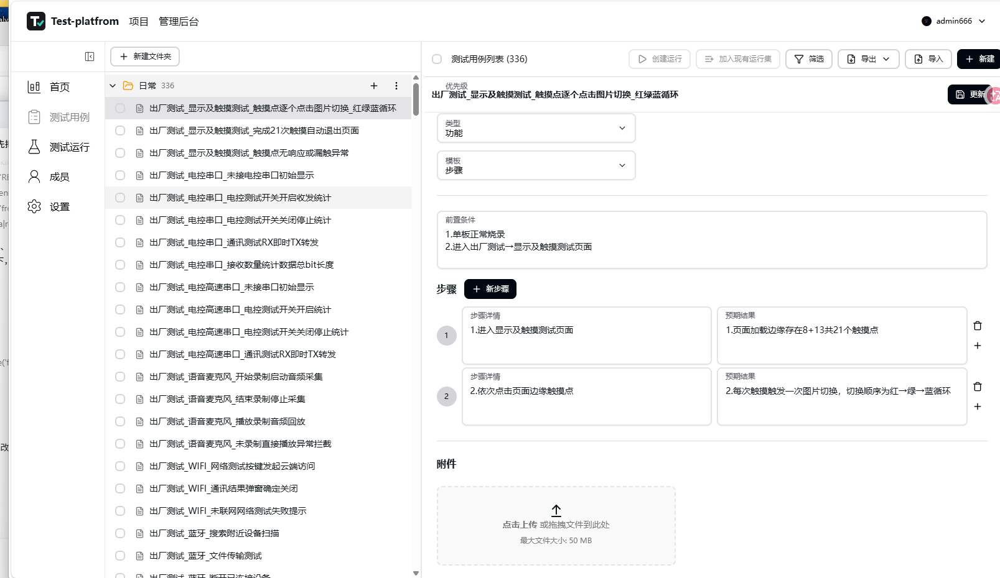
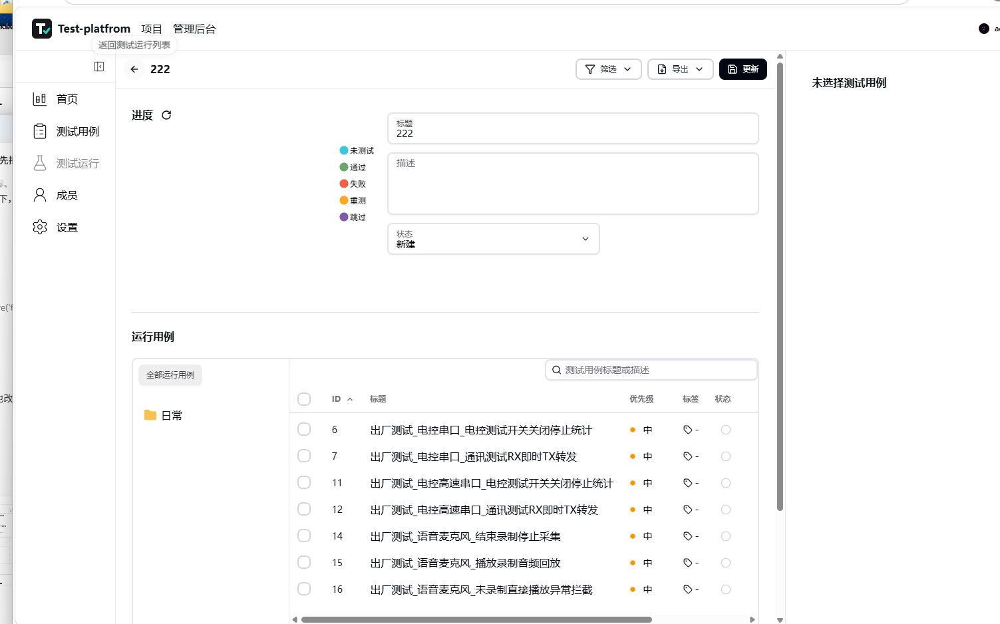

<p align="center">
  
</p>

<h1 align="center">Test-platfrom</h1>

<p align="center">Test Case Management and Test Execution Platform</p>

Test-platfrom builds on UnitTCMS with extensive user experience improvements, including tree-based case navigation, streamlined test-run workflows, and asynchronous updates that reduce full-page reloads.

Designed for self-hosted teams, it brings project-based test case management, test execution, result tracking, and report generation into one platform.

## Key Features

- Organize test cases by project and folder, with a tree view for navigating case details.
- Import Excel test cases, update cases with matching titles, and align steps with expected results by number.
- Create test runs from selected cases or add them to existing runs.
- Assign owners, record statuses and comments, and track testing progress.
- Export Excel test reports with a separate worksheet for each folder.
- Manage accounts, project members, role-based permissions, and project-specific test case types.
- Use a multilingual interface, PostgreSQL storage, and optional OIDC single sign-on.

## Screenshots

### Test Case Details

Browse cases by folder on the left and view preconditions, test steps, expected results, and attachments on the right.



### Bulk Case Selection

Select multiple test cases to create a new run or add them to an existing run.


### Test Runs

Track execution progress, manage run status, and browse the cases included in a run by folder.



## Getting Started

```bash
git clone https://github.com/moliason/Test-platfrom.git
cd Test-platfrom
docker compose up --build
```

Once the application is running, open the [local sign-in page](http://localhost:8000/zh-CN/account/signin).

Configure the initial administrator using `ADMIN_USERNAME`, `ADMIN_EMAIL`, and `ADMIN_PASSWORD` in the Compose environment. Before exposing the application, change the default administrator password, database password, and `SECRET_KEY`. Never commit real credentials to the repository.

- [Running from Source](./docs/docs/getstarted/from-source.md)
- [Environment Configuration](./docs/docs/getstarted/environment.md)
- [OIDC Configuration](./docs/docs/getstarted/oidc.md)
- [Report an Issue](https://github.com/moliason/Test-platfrom/issues)
- [Contributing](./CONTRIBUTING.md)

## License and Attribution

This project is based on [UnitTCMS](https://github.com/kimatata/unittcms) and retains its upstream copyright notice: Copyright © 2024-present UnitTCMS.

The code is licensed under [GPL-3.0](./LICENSE). Test-platfrom is this project's display name; it does not change the license or attribution of the upstream code.
